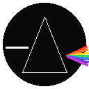
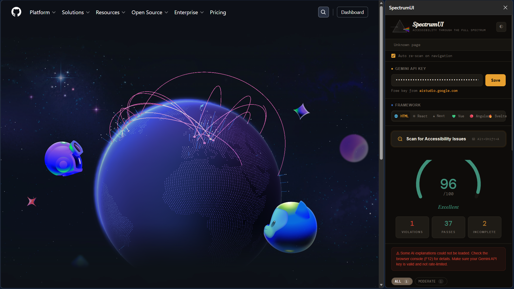
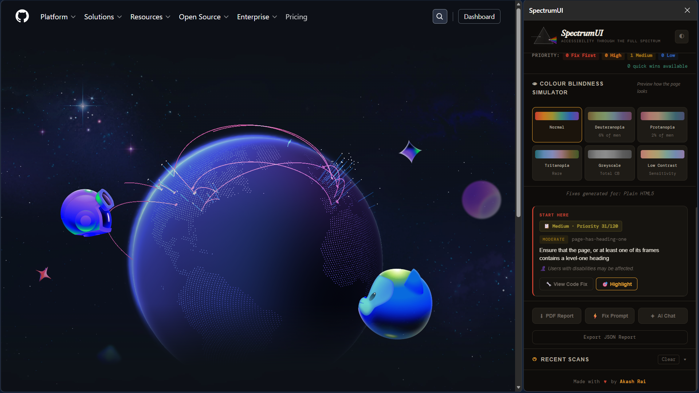
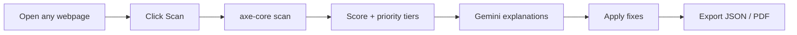

# SpectrumUI

<p align="center">
  
</p>

<p align="center">
  <strong>Accessibility audits with AI-powered fixes — right inside Chrome.</strong>
</p>

<p align="center">
  
  
  
  
</p>

<p align="center">
  <a href="RELEASE_NOTES.md">📦 Release Notes</a>
</p>

---

## ✨ At a Glance

- 🔎 Scan any page using `axe-core`
- 📊 Get a score from `0` to `100`
- 🧠 See plain-English AI explanations + code fixes
- 🎯 Prioritize issues by impact and effort
- 👁 Preview color-vision simulations
- 📝 Export JSON + polished PDF reports
- 💬 Chat with AI Fix Assistant

---

## 🖼 Product Demo





---

## 🚀 Quick Start

### Option A) Install from Release ZIP (`.crx`)

1. Download the latest **release ZIP** from GitHub Releases.
2. Extract the ZIP.
3. Open `chrome://extensions`.
4. Enable **Developer Mode**.
5. Drag and drop the `.crx` file onto the Extensions page.
6. Click **Add extension** when prompted.

> If Chrome blocks third-party `.crx` installs on your system, use **Option B** (`Load unpacked`) below.

### Option B) Install from source (`Load unpacked`)

#### 1) Clone

```bash
git clone <your-repo-url>
cd SpectrumUI
```

#### 2) Add `axe.min.js`

Download from: https://github.com/dequelabs/axe-core/releases

Place file here:

```text
SpectrumUI/
  lib/
    axe.min.js
```

#### 3) Load in Chrome

1. Open `chrome://extensions`
2. Enable **Developer Mode**
3. Click **Load unpacked**
4. Select the `SpectrumUI` folder

#### 4) Save Gemini API Key

1. Open SpectrumUI
2. Paste key in **Gemini API Key**
3. Click **Save**

Get a key at https://aistudio.google.com

---

## 🧭 Typical Workflow



---

## 🧰 Feature Breakdown

### Accessibility Scan
- Runs `axe.run(document, { reporter: 'v2' })` in active tab
- Returns violations, passes, incomplete checks
- Works on regular web pages

### AI Explanations
- Uses `gemini-2.0-flash-lite`
- Provides `plainEnglish`, `whoIsAffected`, `codefix`, `severity`
- Retries automatically and falls back safely if needed

### Framework-Aware Fixes
- HTML, React, Next.js, Vue, Angular, Svelte
- Auto-detect + manual override

### Smart Prioritization
- Factors: severity, affected elements, complexity, WCAG tags
- Tiers: `Fix First`, `High`, `Medium`, `Low`

### Visual Accessibility Simulation
- Deuteranopia, Protanopia, Tritanopia
- Achromatopsia (greyscale), low contrast

### Reporting + History
- Export `spectrumui-report.json`
- Download PDF report via jsPDF
- Keep latest 5 domain scans

---

## ⌨ Keyboard Shortcuts

- `Alt+Shift+A` → Trigger scan flow
- `Alt+Shift+S` → Open extension action

---

## 🧠 How Scoring Works

Starts at `100`, subtracts per violation:

- Critical: `-12`
- Serious: `-8`
- Moderate: `-4`
- Minor: `-2`

Final score is clamped to `0..100`.

---

## 🔒 Privacy

### Stored locally
- API key
- Theme and preferences
- Recent scan history

### Sent externally
- Only violation payload needed for AI explanation/chat

---

## 🛡 Permissions

- `activeTab` — run scans and interact with active page
- `scripting` — extension-page script interactions
- `storage` — persist key/settings/history
- `sidePanel` — side panel experience
- `notifications` — warnings for restricted pages
---

## 📁 Project Structure

```text
SpectrumUI/
├─ manifest.json
├─ background.js
├─ content.js
├─ ai.js
├─ chatbot.js
├─ colorblind.js
├─ report.js
├─ popup.html/.css/.js
├─ sidepanel.html/.css/.js
├─ icons/
└─ lib/
   ├─ axe.min.js
   └─ jspdf.umd.min.js
```

---

## 🧪 Troubleshooting

### “Cannot scan this page”
Restricted URLs are blocked (`chrome://`, `about:`, `devtools://`, etc.). Use a regular website URL.

### “axe-core is not loaded”
`lib/axe.min.js` is missing/invalid. Add it, then reload extension.

### AI explanations failed
Usually key/rate-limit/network related. SpectrumUI retries and falls back to non-AI descriptions.

---
